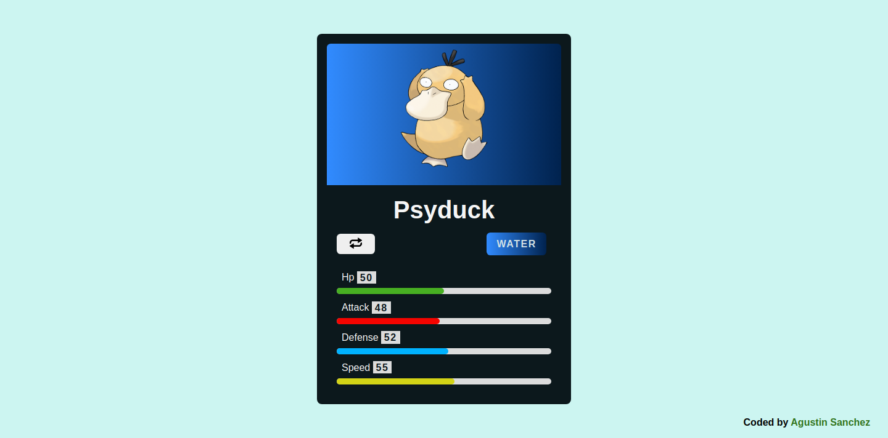
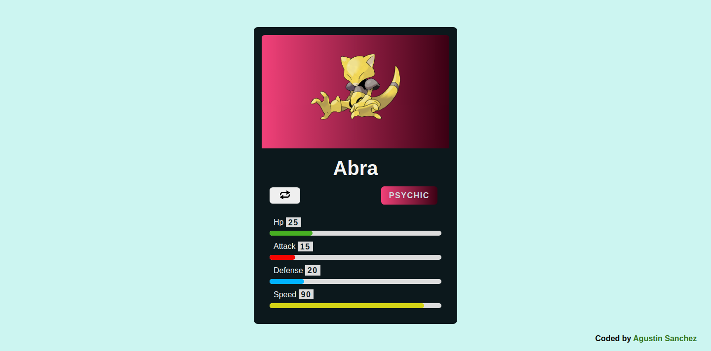
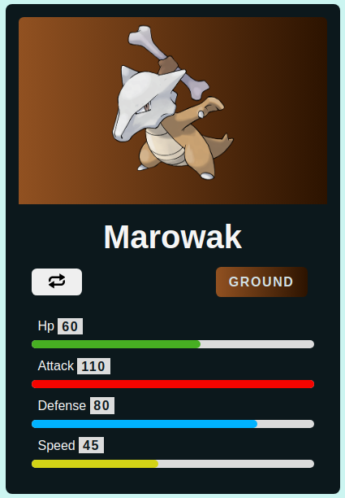

# Poke Random Generator Js

- Generate a random pokemon card (first generation)

## Built with

 
 
 

- Semantic HTML5 markup
- CSS custom properties
- Flexbox
- Media queries and responsive design
- JavaScript functions and DOM events
- API manage

## Screenshots

- Desktop view

- Mobile view

## Link

- [Live site](https://poke-random-generator-js.vercel.app/)

## Author

- Linkedin - [Agustin Emanuel Sanchez](https://www.linkedin.com/in/agustin-emanuel-sanchez-4b2807240/)
- Frontend Mentor - [@agusscript](https://www.frontendmentor.io/profile/agusscript)
- CodePen - [Agustin Sanchez](https://codepen.io/agusscript)
- Twitter - [@agus_script](https://twitter.com/agus_script)
